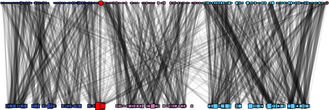
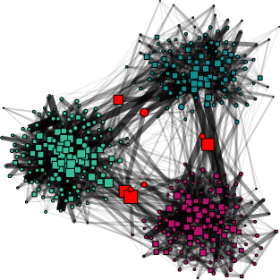
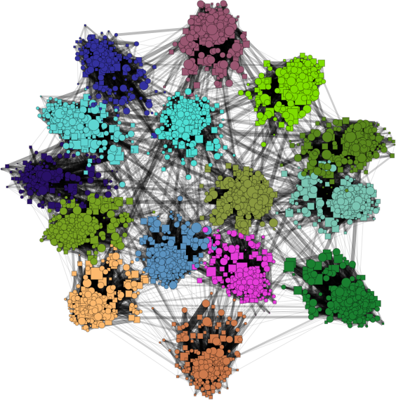
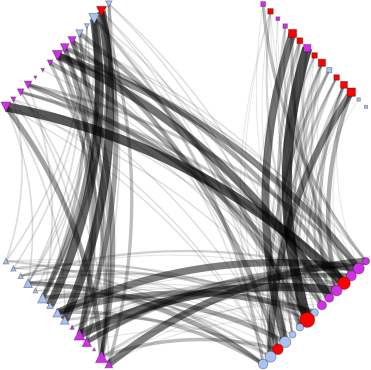
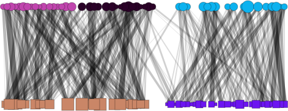

### PyNetViewer: A tool for visualization of bipartite, k-partite and heterogeneous networks

**About**

PyNetViewer is a python and igraph based tool for visualization of bipartite, k-partite and heterogeneous networks. 
The main aim of the PyNetViewer is the visualization of the benchmark networks synthesized by the Bnoc tool. 

**Usage**

PyNetViewer may operate in two modes: 1. using explicit command line parameters (or options) or 2. using a JSON config 
file (JavaScript Object Notation).

**Command line parameters**

    $ python pynetviewer.py [options]

| Option                                | Domain                | Default        | Description                                                    |
| ------------------------------------- | ----------------------| -------------- | -------------------------------------------------------------- |
| -in --input                           | str [FILE]            | 'input'        | input filename '.ncol' format                                  |
| -dir --output_directory               | str [DIR]             | '.'            | directory of output file                                       |
| -out --output                         | str [FILE]            | 'out'          | output filename                                                |
| -cnf --conf                           | str [FILE]            | None           | Input parameters in .json format                               |
| -type --file_type                     | str [FILE]            | None           | graph type file name                                           |
| -m --file_membership                  | str [FILE]            | None           | membership labels file name                                    |
| -w --file_weight                      | str [FILE]            | None           | vertex weight filen name                                       |
| -xy --file_layout                     | str [FILE]            | None           | layout xy file name                                            |
| -clr --file_color                     | str [FILE]            | None           | colors file name                                               |
| -di, --delete_vertex_by_degree_le     | int array             | false          | delete vertex by degree                                        |
| -dwle, --delete_edge_by_weight_le     | boolean               | false          | delete edge by weight less than or equal to                    |
| -cdt, --community_detection_algorithm | str                   | fastgreedy     | community detection algorithm                                  |
| -os, --overlapping_shape              | str                   | rectangle      | overlap shape                                                  |
| -op, --overlapping_paint              | boolean               | false          | paint overlap vertex                                           |
| -oc, --overlapping_color              | str                   | red            | overlapping vertex color                                       |
| -vfc, --vertex_frame_color            | str                   | white          | vertex frame color (vertex border)                             |
| -vfw, --vertex_frame_width            | float                 | 1.0            | vertex frame width (vertex border)                             |
| -v, --vertices                        | int array             | [10, 10]       | number of vertices for each layer                              |
| -k, --number_of_communites            | int                   | 2              | number of communities                                          |
| -mg, --margin                         | int                   | 20             | image margin                                                   |
| -vmin, --vertex_size_min              | int                   | 6              | minimum vertex size                                            |
| -vmax, --vertex_size_max              | int                   | 100            | maximum vertex size                                            |
| -wmin, --edge_weight_min              | int                   | 10             | minimum vertex weight                                          |
| -wmax, --edge_weight_max              | int                   | 10             | maximum vertex weight                                          |
| -omin, --edge_opacity_min             | float                 | 0.01           | minimum opacity for degree                                     |
| -omax, --edge_opacity_max             | int                   | 0.08           | maximum opacity for degree                                     |
| -b, --bbox                            | int array             | [300, 300]     | the bounding box of the plot                                   |
| -lyt, --layout_name                   | str                   | fr             | layout name                                                    |
| -crv, --edge_curved                   | boolean               | false          | edge curved                                                    |
| -rtt, --pdf_rotete                    | boolean               | false          | rotated output                                                 |
| -trm, --img_trim                      | boolean               | false          | trim output                                                    |
| -pdf, --save_pdf                      | boolean               | false          | save pdf                                                       |
| -png, --save_png                      | boolean               | false          | save png                                                       |
| -shw, --show                          | boolean               | false          | plot output                                                    |
| -sp --split_projections               | int array             | false          | split the networks into its one-mode projections               |
| -ube --use_boundary_edges             | boolean               | false          | force the use of boundary edges in the layout                  |
| -lytn --layout_niter                  | int                   | 500            | number of iterations in layout                                 |
| -lytg --layout_gravity                | float                 | 10.0           | gravity in Force Atlas 2 layout                                |
| -lytsr --layout_scaling_ratio         | float                 | 5.0            | scaling ration in Force Atlas 2 layout                         |
| -lytr --layout_to_radial              | boolean               | false          | convert layout to radial base                                  |
| -lytha --layout_hub_attraction        | boolean               | false          | hub attraction in Force Atlas 2 layout                         |
| -giant --only_giant_component         | boolean               | false          | plot only giant component                                      |
| -vsb --vertex_size_by                 | str                   | degree         | set vertex size based on degree, weight or neither of them     |
| -vcb --vertex_color_by                | str                   | degree         | set vertex size based on degree, membership or neither of them |

**JSON option**

    $ python bnoc.py -cnf options.json

JSON format: Data is in name/value pairs, separated by commas, curly braces hold objects and square brackets hold arrays.

```javascript
{
    "option": "value"
}
```

**Examples**

You can use a config file (.json) to specify the parameters, for instance:

	$ python pynetviewer.py -cnf input/bipartite_1_layout_1.json
	

	
	$ python pynetviewer.py -cnf input/bipartite_1_layout_2.json
	

	
	$ python pynetviewer.py -cnf input/bipartite_2.json
	
	
	
	$ python pynetviewer.py -cnf input/bipartite_3.json

	
	
	$ python pynetviewer.py -cnf input/kpartite.json
	
	
	
	$ python pynetviewer.py -cnf input/heterogeneous.json
	


**Notes**

In k-partite networks there are two types of community definitions: First, one-to-one correspondence, that is the same
as the definition of community structure in unipartite networks, i.e., there are the same number of communities in the
each layer and the communities are correspondents between layers (Figure 1a). 2. many-to-many correspondence, in which
there are different number of communities in the layers and the communities are independents between layers (Figure 1b).
The `membership` file must represent both scenarios, i.e., vertices in the same community must have the same
community_id and vertices from different communities must have different community_id, regardless of the layer they
are assigned in.

| 1a) One-to-one definition       | 1b) Many-to-many definition      |         
| ------------------------------- | -------------------------------- |
|          |         |

**Instal**

> Pip
    
    $ pip install -r requirements.txt

> Or Anaconda env

    $ conda env create -f environment.yml
    $ conda activate pynetviewer

> Or Anaconda create

    $ conda create --name pynetviewer python=3.7.2
    $ conda activate pynetviewer
    $ conda install -c anaconda numpy
    $ conda install -c conda-forge python-igraph # python-igraph=0.7.1 for old layout versions
    $ conda install -c conda-forge colour
    $ conda install -c anaconda pyyaml
    $ conda install -c conda-forge pypdf2
    $ conda install -c anaconda scipy
    $ conda install -c anaconda networkx
    $ sudo apt install texlive-extra-utils
    $ sudo apt install imagemagick
    
> Install ForceAtlas2 for Python: https://github.com/bhargavchippada/forceatlas2

    $ pip install fa2

**Release History**

- 0.1.0
    - The first proper release
- 0.0.1
    - Work in progress

**Contributing**

- Pull requests are welcome. For major changes, please open an issue first to discuss what you would like to change.
- Please make sure to update tests as appropriate.

1. Fork it (https://github.com/alanvalejo/pynetviewer/fork)
2. Create your feature branch (git checkout -b feature/fooBar)
3. Commit your changes (git commit -am 'Add some fooBar')
4. Push to the branch (git push origin feature/fooBar)
5. Create a new Pull Request

**Known Bugs**

- Please contact the author for problems and bug report.

**Contact**

- Alan Valejo
- alanvalejo@gmail.com.br
- www.alanvalejo.com.br
- Postdoctoral research fellow at the University of São Paulo (USP), Brazil

**License and credits**

- Giving credit to the author by citing the papers [1]
- The GNU General Public License v3.0
- This program comes with ABSOLUTELY NO WARRANTY. THE ENTIRE RISK AS TO THE QUALITY AND PERFORMANCE OF THE PROGRAM IS
 WITH YOU.
- Owner or contributors are not liable for any direct, indirect, incidental, special, exemplary, or consequential 
damages, (such as loss of data or profits, and others) arising in any way out of the use of this software, even if 
advised of the possibility of such damage.
- This program is free software and distributed in the hope that it will be useful: you can redistribute it and/or 
modify it under the terms of the GNU General Public License as published by the Free Software Foundation, either 
version 3 of the License, or (at your option) any later version. See the GNU General Public License for more details. 
You should have received a copy of the GNU General Public License along with this program.
If not, see http://www.gnu.org/licenses/.
**To-do list**

- Explicitly seed a global variable or parameter to achieve reproducibility
- Improve usage section

**References**

> [1] Valejo, Alan and Goes, F. and Romanetto, L. M. and Oliveira, Maria C. F. and Lopes, A. A., A benchmarking tool 
>for the generation of bipartite network models with overlapping communities, in Knowledge and information systems, 
>vol. 62, p. 1641-1669, 2019, doi: https://doi.org/10.1007/s10115-019-01411-9

~~~~~{.bib}
@article{valejo2019benchmarking,
    author = {Valejo, Alan and Goes, F. and Romanetto, L. M. and Oliveira, Maria C. F. and Lopes, A. A.},
    title = {A benchmarking tool for the generation of bipartite network models with overlapping communities},
    journal = {Knowledge and information systems},
    year = {2019},
    pages = {1-29},
    doi = {https://doi.org/10.1007/s10115-019-01411-9}
}
~~~~~
<div class="footer"> &copy; Copyright (C) 2016 Alan Valejo &lt;alanvalejo@gmail.com&gt; All rights reserved.</div>
